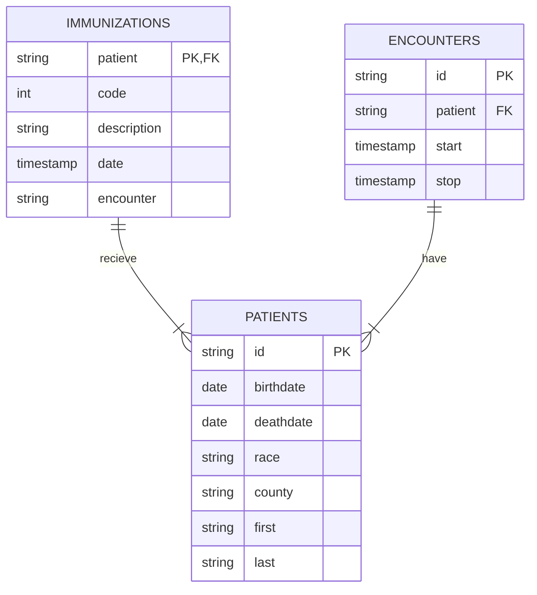

# Healthcare Exploratory Data Project using SQL

In this project I used the programming language SQL to complete an exploratory data analysis of hospital patients created by Synthea. [Synthea](https://synthetichealth.github.io/synthea/) is an open-source, synthetic patient generator that models the medical history of synthetic patients.

Performing the analyzation will allow me to discover patterns, spot anomalies, find outliers, answer questions & assumptions, test hypotheses, and find interesting relationships between the variables. Since the data is generated, there was very little manipulating and cleaning to do. Despite knowing the data would be fairly clean I still explored and read through the data with queries viewing all the columns in each table.

First I downloaded individual CSV files from Synthea to obtain the `Patients`, `Immunizations`, and `Encounters` tables. I then created the Synthea Healthcare dataset in BigQuery and imported the tables into it. 

I had a set of questions regarding the dataset & I knew what data I was looking to retrieve. The requirements were to find active hospital patients older than 6 months old, who received the flu shot once in the year 2021.

Other questions requested in order to build out a dashboard with the data were:

1. Total % of patients getting flu shots

       by Age, Race, Gender, County, and the Overall number

1. Running total of flu shots over the course of 2021
2. Total number of flu shots given in 2021
3. List of patients who did or did not receive the flu shot
4. Demographics (age, race, gender) of patients who did not receive the flu shot

I then proceeded to query the tables in order to see what types of data was stored inside and where the tables will join by primary and foreign keys:

```sql
SELECT *
FROM `healthcareeda-396011.SyntheaHealthcare.patients`

--To view the columns in the Patient table 
-- and see if there's birthdate or age, race, county

SELECT pat.birthdate, pat.race, pat.county, pat.gender, pat.id, pat.first, pat.last
FROM `healthcareeda-396011.SyntheaHealthcare.patients` as pat

--These are the columns I was able to extract the patient data from
```

I noticed in both the First and Last name columns  3 numbers followed each entry, so I cleaned the two columns by using the **SUBSTR** function:

```sql
SELECT pat.birthdate, pat.race, pat.county, pat.gender, pat.id, 
SUBSTR(pat.first, 1,length(pat.first)-3) as first, 
SUBSTR(pat.last, 1,length(pat.last)-3) as last
FROM `healthcareeda-396011.SyntheaHealthcare.patients` as pat
```

Here I view into the `Immunizations` table:

```sql
SELECT *
FROM immunizations

SELECT *
FROM `healthcareeda-396011.SyntheaHealthcare.immunizations`
WHERE code = 140
  AND date BETWEEN '2021-01-01 00:00:00' AND '2021-12-31 23:59:00'

--description column contains flu vaccination details, each description 
-- has it's own code, flu is 140. 
```



Knowing I would need to join the tables in order to answer the question, a one to one  join was created to see patients and the earliest time they received a flu shot, without repeating rows. I also made a **CTE** which would be a temporary holding place to store the drilled down `Immunizations` table and `Encounters` table later in my query:

```sql
--The CTE made to hold the drilled down Immunization table result, 
--filtering the year and flu vaccination 

WITH flu_shot_2021 AS
(
SELECT patient, MIN(DATE) AS earliest_flu_shot_2021
FROM `healthcareeda-396011.SyntheaHealthcare.immunizations`
WHERE code = 140
  AND date BETWEEN '2021-01-01 00:00:00' AND '2021-12-31 23:59:00'
GROUP BY patient
)

SELECT pat.birthdate, pat.race, pat.county, pat.id, 
SUBSTR(pat.first, 1,length(pat.first)-3) as first, 
SUBSTR(pat.last, 1,length(pat.last)-3) as last
FROM `healthcareeda-396011.SyntheaHealthcare.patients` as pat
left join flu_shot_2021 as flu
	on pat.id = flu.patient

--*Left Join used to recieve all the patient despite having their vaccinations or not
```

A **CASE** statement was used to obtain a binary field in the `Patients` table  in order to add  the number of patients with flu shots and to create percentages easily.

```sql
WITH flu_shot_2021 AS
(
SELECT patient, MIN(DATE) AS earliest_flu_shot_2021
FROM `healthcareeda-396011.SyntheaHealthcare.immunizations`
WHERE code = 140
  AND date BETWEEN '2021-01-01 00:00:00' AND '2021-12-31 23:59:00'
GROUP BY patient
)

SELECT pat.birthdate, pat.race, pat.county, pat.gender, pat.id, 
SUBSTR(pat.first, 1,length(pat.first)-3) as first, 
SUBSTR(pat.last, 1,length(pat.last)-3) as last,
flu.earliest_flu_shot_2021, --To see the results from the joined Immunization table --
  case when flu.patient is not null then 1
  else 0
  end as flu_shot_2021
FROM `healthcareeda-396011.SyntheaHealthcare.patients` as pat
LEFT JOIN flu_shot_2021 as flu
	ON pat.id = flu.patient
```

An additional CTE was added to the query in order to narrow down the results and remove patients that have died or moved in the last few years. This information was stored within the `Encounters` table.
The patients filtered by the `Encounters` table CTE are called in the last **WHERE** statement as `patient` in `active_patients`

```sql
WITH flu_shot_2021 as
(
SELECT patient, min(date) as earliest_flu_shot_2021
FROM `healthcareeda-396011.SyntheaHealthcare.immunizations`
WHERE code = 140
  AND date BETWEEN '2021-01-01 00:00:00' AND '2021-12-31 23:59:00'
GROUP BY patient
),

active_patients as
(
SELECT patient, DATE_DIFF('2021-12-31', pat.birthdate, MONTH) AS age_in_months
FROM `healthcareeda-396011.SyntheaHealthcare.encounters` as e
JOIN `healthcareeda-396011.SyntheaHealthcare.patients` as pat
	on e.patient = pat.id
WHERE start BETWEEN '2019-01-01 00:00:00' and '2021-12-31 23:59:00'
	and pat.deathdate is null
	and DATE_DIFF('2021-12-31', pat.birthdate,MONTH) >= 6
)

SELECT pat.birthdate, pat.race, pat.county, pat.gender, pat.id, 
SUBSTR(pat.first, 1,length(pat.first)-3) as first, 
SUBSTR(pat.last, 1,length(pat.last)-3) as last,
flu.earliest_flu_shot_2021, 
  case when flu.patient is not null then 1
  else 0
  end as flu_shot_2021
FROM `healthcareeda-396011.SyntheaHealthcare.patients` as pat
left join flu_shot_2021 as flu
	on pat.id = flu.patient
where 1=1
	and pat.id in(SELECT patient FROM active_patients) 
```

The end query brings our results down to 995 from the initial 1163 .

### Summary

 Through exploring the datasets and reading what values they held I was able to create queries that will result in visual charts to produce easily accessible data. This project allowed me to utilize SQL and learn how different statements such as CTE’s, CASE, SUBSTR, and LEFT JOIN can lead to successful and insightful data analyzing. Finding the variables that are required for statistics is key to delivering what stakeholders and a general audience can see within data.
